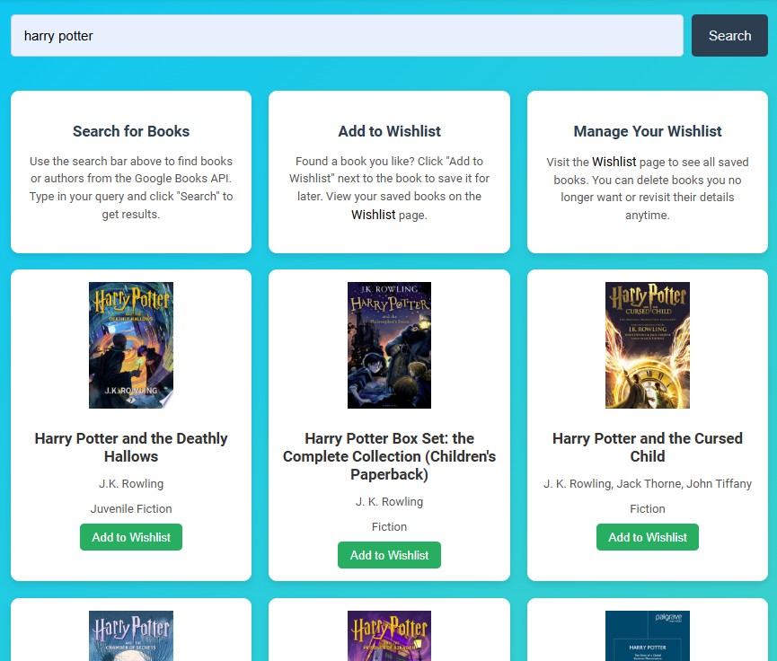
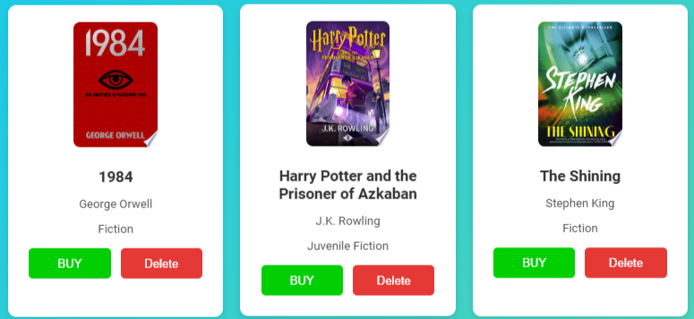
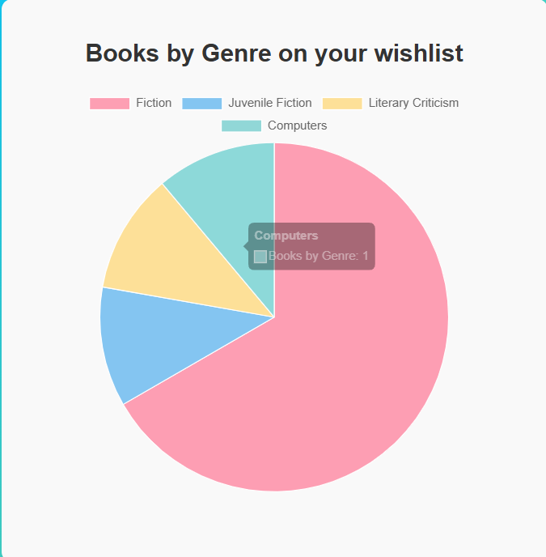

# Google Books Wishlist

## Overview
Google Books Wishlist is a web application that allows users to search for books using the Google Books API, add their favorite books to a wishlist, and manage their collection. The application also provides a pie chart visualization of the genres in the user's wishlist, enabling users to track their reading preferences.

## Features
- **Book Search**: Search for books by title, author, or genre through the Google Books API.
- **Wishlist Management**: Add books to a wishlist, delete them, or purchase directly via Amazon.
- **Genre Visualization**: View a dynamic pie chart of the genres of books in your wishlist.
- **Responsive Design**: Designed to provide a seamless user experience on different devices.

## Technologies Used
### Frontend
- **HTML/CSS**: Structure and styling of the application.
- **JavaScript**: DOM manipulation, fetch API requests, and event handling.
- **Chart.js**: For genre distribution visualization.

### Backend
- **Node.js**: Server-side functionality.
- **Express.js**: Framework for routing and HTTP requests.
- **File System (fs)**: For managing wishlist data in a JSON file.
- **Nodemon**: Development tool for automatic server restarts.

## Installation and Setup
Follow these steps to set up the application on your local machine:

1. **Clone the Repository**:
   ```bash
   git clone https://github.com/yourusername/Book-Wishlist.git
   cd CA2WebApp
   ```

2. **Install Dependencies**:
   Ensure you have **Node.js** and **npm** installed. Then, run:
   ```bash
   npm install
   npm install express
   ```

3. **Navigate to the Server Folder**:
   Change to the `server` folder where the backend code is located:
   ```bash
   cd ./server/
   ```

4. **Start the Server**:
   Use the following command to start the server:
   ```bash
   node app.js
   ```
   If you have **Nodemon** installed, you can use it for automatic server restarts:
   ```bash
   nodemon app.js
   ```

5. **Access the Application**:
   Open your browser and go to:
   ```
   http://localhost:3000
   ```

## Usage
### Searching for Books
1. Enter a search term (e.g., title, author, or genre) in the search bar on the main page.
2. Click the **Search** button to display books fetched from the Google Books API.


### Managing the Wishlist
1. Click **Add to Wishlist** to save a book to your personal wishlist.
2. Navigate to the **Wishlist** page to view all added books.
3. Use the **Delete** button to remove books from your wishlist.
4. Click **Buy** to visit Amazon and purchase the book.


### Visualizing Genres
On the wishlist page, view a dynamic pie chart that displays the distribution of books by genre in your wishlist.


## Contributing
Contributions are welcome! If you'd like to improve this project, follow these steps:
1. Fork the repository.
2. Create a feature branch (`git checkout -b feature-name`).
3. Commit your changes (`git commit -m 'Add new feature'`).
4. Push to the branch (`git push origin feature-name`).
5. Open a pull request.

## License
This project is licensed under the MIT License. See the [LICENSE](LICENSE) file for details.

## Acknowledgments
- Google Books API for providing access to book data.
- Chart.js for enabling data visualization.
- Open-source contributors for tools like Node.js, Express.js, and Nodemon.

---

Feel free to reach out for any questions or suggestions!
